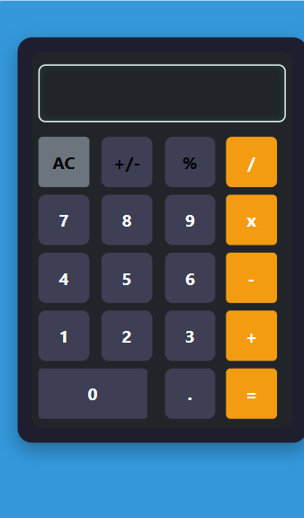

# 🧮 Simple Web Calculator

**Simple Web Calculator** is a lightweight, responsive web application for performing basic arithmetic operations. Perfect for quick calculations in a clean, user-friendly interface.

> ⚡ Built entirely using HTML, CSS, and JavaScript — no backend or setup required!

---

## 🌟 Features

- ➕ **Addition**, ➖ **Subtraction**, ✖️ **Multiplication**, ➗ **Division**
- 🔄 Clear/Reset button to start fresh
- ✅ Handles invalid inputs gracefully
- 📱 Fully **responsive** — works on all screen sizes
- 🎨 Clean and **minimal UI** for distraction-free use

---

## 🖥️ Tech Stack

- ✅ **HTML5**  
- ✅ **CSS3** — for layout and responsive styling  
- ✅ **JavaScript** — for interactive logic and user input handling  

---

## 📸 Screenshots

| Calculator UI | Mobile View |
|---------------|-------------|
|  |  |

---

## 🚀 Live Preview

🔗 [**Click Here to Try the Calculator**](https://Devarajb049.github.io/Calculator)

---

## 📂 How to Use

### 🔧 Steps

1. **Clone the Repository**:
   ```bash
   git clone https://github.com/Devarajb049/Calculator.git
   cd Calculator
